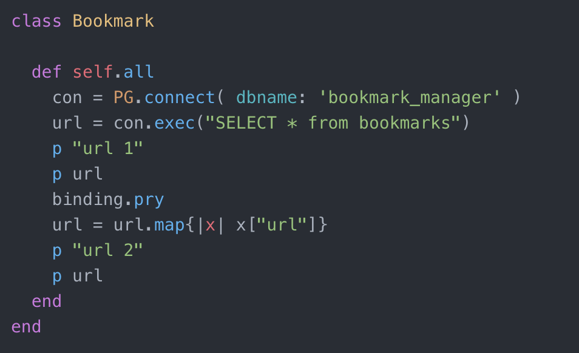

## binding.pry

Use `binding.pry` in your code to stop in the middle of the running program. <br>
This allows you to follow the debugging mentality of gaining visibility while tightening the loop.

### Installation

You will need the `pry` gem, so include that in your Gemfile. Run in your terminal:
```
gem install pry
```

### How to Use

I will take the bookmark_manager project as an example as I was not very clear on the object concept on how the url data was stored and can be extracted into `Bookmark.all`. <br>

I include `binding.pry` into my code as follow:<br>


and I will get this: <br>


So on your terminal you can run methods on `url` variable. To simply check what I get in `url`, i type that in pry:


To check what methods you can run on `url`, type `url.methods` on your pry and you will see a list of methods that can be run on `url`. From there I can find method such as :each. That means I can run `url.each`. <br>

If there are more than one `binding.pry` in your code, simply do exit and you should still be in pry. Then run the file again and your programme will stop at the next binding.pry. If you have 3 `binding.pry`, you will need to enter `exit` 3 times to come out of pry.

#### Example of Use

So `binding.pry` is very helpful for debugging. In this case I actually used this approach to understand what object was returned after `PG.connect( dbname: 'bookmark_manager' )`
`url = con.exec("SELECT * from bookmarks")`
and returns`#<PG::Result:0x00007f9d2ea58b38 status=PGRES_TUPLES_OK ntuples=4 nfields=2 cmd_tuples=4>`. <br>

In a class, the initialized variables can be private, i.e. not shown. We can choose what information can be shown about an object. This can avoid a long chunk of information being displayed and avoid very long error messages (see my `takeaway` object in `takeaway_challenge`, where all the hashes of menu and order are being shown).
